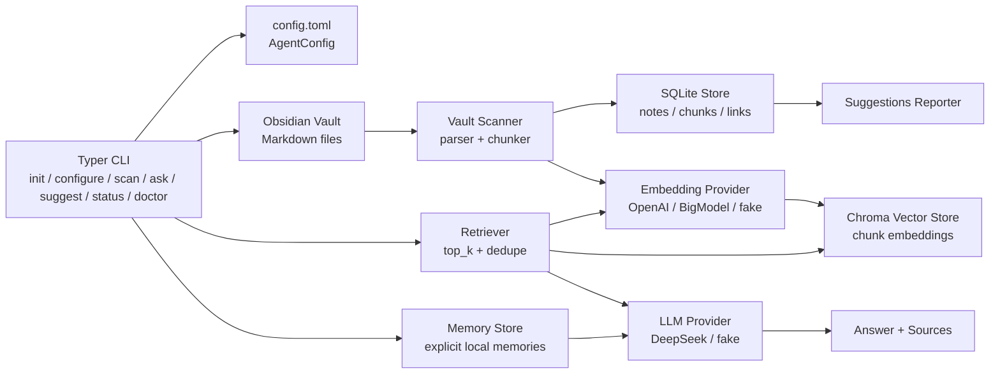

# Obsidian Agent 项目说明

## 1. 项目介绍

Obsidian Agent 是一个面向 Obsidian 知识库的本地只读 CLI Agent。它会扫描本地 Markdown vault，将笔记解析、切块、索引到本地数据目录，然后通过向量检索与大模型回答问题。

当前版本聚焦 MVP 能力：

- 只读管理 Obsidian vault，不修改原始笔记文件。
- 将 Markdown 笔记扫描进本地 SQLite 元数据存储。
- 使用 Chroma 持久化向量索引。
- 支持 DeepSeek 作为回答模型。
- 支持 OpenAI、OpenAI-compatible、BigModel embedding，以及测试用 fake provider。
- 支持显式本地记忆体，用于保存用户手动添加的偏好或长期上下文。
- 提供 `ask`、`scan`、`suggest`、`status`、`doctor`、`configure` 等 CLI 命令。

适合的第一阶段使用场景：

- 对个人知识库做自然语言问答。
- 检查知识库结构与潜在整理建议。
- 调试检索命中结果、chunk 数量、`top_k` 等参数。
- 手动保存少量长期偏好，并在需要时带入问答上下文。
- 为后续更复杂的文档管理 Agent 打基础。

## 2. 核心能力

### 2.1 Vault 扫描

`obsidian-agent scan` 会遍历配置的 Obsidian vault，读取 Markdown 文件，跳过 `.obsidian`、`.git`、`node_modules` 等目录，并按配置限制最大文件大小。

扫描过程会生成：

- note 元数据：路径、标题、hash、更新时间等。
- chunk 数据：按标题和目标 token 数切分的文本片段。
- backlink 数据：基于内部链接重建的双向关系。
- 向量索引：每个 chunk 对应一条 embedding。

### 2.2 检索问答

`obsidian-agent ask "问题"` 的流程是：

1. 对问题生成 query embedding。
2. 在 Chroma 中按相似度检索 top-k chunk。
3. 对检索结果去重，并限制单篇笔记过度占据上下文。
4. 将问题和笔记片段发送给 LLM。
5. 输出答案和来源文件。

调试检索时可以使用：

```bash
obsidian-agent ask "问题" --show-context
obsidian-agent ask "问题" --show-context --top-k 10 --context-chars 120
```

### 2.3 配置与健康检查

`obsidian-agent configure` 用于查看或持久化常用配置：

```bash
obsidian-agent configure
obsidian-agent configure --top-k 10
obsidian-agent configure --target-tokens 800 --max-tokens 1000
obsidian-agent configure --preset deepseek-bigmodel
```

`obsidian-agent doctor` 用于排查环境：

```bash
obsidian-agent doctor
obsidian-agent doctor --network
```

默认 `doctor` 只检查本地配置、vault 路径和环境变量。`--network` 会向配置的 embedding provider 和 LLM provider 发送最小测试请求。

### 2.4 本地记忆体

第一版记忆体是显式本地记忆，不会自动记录对话，也不会默认参与问答。用户需要手动添加、查看和检索：

```bash
obsidian-agent memory add "User prefers concise answers."
obsidian-agent memory list
obsidian-agent memory search "concise answers"
```

问答时通过 `--use-memory` 显式启用：

```bash
obsidian-agent ask "请结合我的偏好回答。" --use-memory
```

记忆数据保存在 `.obsidian-agent/memory.db`。`ask --use-memory` 会按问题关键词检索相关记忆，并把命中的记忆作为额外上下文传给 LLM。

## 3. 系统架构



### 3.1 模块划分

| 模块 | 位置 | 职责 |
| --- | --- | --- |
| CLI | `src/obsidian_agent/cli.py` | 命令入口、参数解析、编排各模块 |
| 配置 | `src/obsidian_agent/config.py` | TOML 配置读写、provider preset、默认参数 |
| Vault | `src/obsidian_agent/vault/` | Markdown 解析、标题识别、chunk 切分、文件扫描 |
| Storage | `src/obsidian_agent/storage/` | SQLite 元数据、Chroma 向量索引、内存向量库 |
| Memory | `src/obsidian_agent/storage/memory_store.py` | 显式本地记忆的增删查基础存储 |
| Retrieval | `src/obsidian_agent/retrieval/` | 检索、去重、问答上下文组织 |
| Providers | `src/obsidian_agent/providers/` | DeepSeek、OpenAI、BigModel、fake provider |
| Suggestions | `src/obsidian_agent/suggestions/` | 知识库整理建议与报告渲染 |
| Tests | `tests/` | CLI、配置、扫描、检索、存储、建议规则测试 |

### 3.2 数据目录

默认数据目录是当前运行目录下的 `.obsidian-agent/`：

```text
.obsidian-agent/
  config.toml
  agent.db
  memory.db
  vectors/
  reports/
```

说明：

- `config.toml`：vault 路径、模型 provider、chunking、retrieval 等配置。
- `agent.db`：SQLite 数据库，保存 note、chunk、link、扫描摘要。
- `memory.db`：SQLite 数据库，保存用户手动添加的本地记忆。
- `vectors/`：Chroma 持久化向量索引。
- `reports/`：建议报告输出目录。

## 4. 安装说明

### 4.1 环境要求

- macOS、Linux 或其他支持 Python 的本地环境。
- Python `>=3.11`。
- 一个 Obsidian vault 目录。
- 如使用真实模型，需要对应 API key。

项目依赖由 `pyproject.toml` 管理，核心依赖包括：

- `typer`：CLI 框架。
- `rich`：终端输出。
- `chromadb`：本地向量索引。
- `openai`：OpenAI-compatible SDK。
- `httpx`：BigModel embedding HTTP 调用。
- `tomli-w`：TOML 写入。
- `pytest`：测试。

### 4.2 本地开发安装

推荐在项目根目录创建虚拟环境：

```bash
cd /path/to/AI_Agent_project
python3 -m venv .venv
.venv/bin/python -m pip install -e ".[dev]"
```

如果使用 `uv`：

```bash
cd /path/to/AI_Agent_project
uv venv
uv pip install -e ".[dev]"
```

验证 CLI 是否可用：

```bash
obsidian-agent --help
```

如果没有安装 editable package，也可以用源码路径运行：

```bash
PYTHONPATH=src .venv/bin/python -m obsidian_agent.cli --help
```

## 5. 配置说明

### 5.1 默认配置

初始化：

```bash
obsidian-agent init --vault "/path/to/your/Obsidian vault"
```

默认 provider：

- LLM：DeepSeek，环境变量 `DEEPSEEK_API_KEY`。
- Embedding：OpenAI，环境变量 `OPENAI_API_KEY`。

### 5.2 DeepSeek + BigModel 配置

设置环境变量：

```bash
export DEEPSEEK_API_KEY="<your-deepseek-api-key>"
export EMBEDDING_API_KEY="<your-bigmodel-api-key>"
```

使用 preset 初始化：

```bash
obsidian-agent init --vault "/path/to/your/Obsidian vault" --preset deepseek-bigmodel
```

该 preset 会写入：

```toml
[llm]
provider = "deepseek"
base_url = "https://api.deepseek.com"
api_key_env = "DEEPSEEK_API_KEY"
chat_model = "deepseek-v4-pro"
thinking = true
reasoning_effort = "high"

[embedding]
provider = "openai_compatible"
base_url = "https://open.bigmodel.cn/api/paas/v4/embeddings"
api_key_env = "EMBEDDING_API_KEY"
embedding_model = "embedding-3"
dimensions = 1536
```

### 5.3 检索和切块参数

查看当前常用配置：

```bash
obsidian-agent configure
```

持久化默认 `top_k` 和切块参数：

```bash
obsidian-agent configure --top-k 10
obsidian-agent configure --target-tokens 800 --max-tokens 1000
```

切换 provider preset：

```bash
obsidian-agent configure --preset deepseek-bigmodel
obsidian-agent configure --preset default
```

单次问答临时覆盖：

```bash
obsidian-agent ask "问题" --top-k 10
```

### 5.4 记忆体

添加记忆：

```bash
obsidian-agent memory add "User prefers concise answers."
```

查看和搜索：

```bash
obsidian-agent memory list
obsidian-agent memory search "concise answers"
```

问答时启用记忆：

```bash
obsidian-agent ask "请结合我的偏好回答。" --use-memory
obsidian-agent ask "请结合我的偏好回答。" --use-memory --memory-top-k 5
```

## 6. 部署与运行

### 6.1 本地 CLI 部署

当前项目是本地 CLI 应用，推荐部署方式是安装到本机虚拟环境：

```bash
cd /path/to/AI_Agent_project
.venv/bin/python -m pip install -e .
```

初始化数据目录：

```bash
obsidian-agent init --vault "/path/to/your/Obsidian vault" --preset deepseek-bigmodel
```

执行健康检查：

```bash
obsidian-agent doctor
obsidian-agent doctor --network
```

首次构建索引：

```bash
obsidian-agent scan --rebuild
```

问答：

```bash
obsidian-agent ask "这个知识库主要记录了什么？"
```

### 6.2 离线开发模式

不想调用外部模型时使用 fake provider：

```bash
obsidian-agent scan --embedding-provider fake
obsidian-agent ask "agent project" --embedding-provider fake --llm-provider fake
```

这适合本地测试 CLI、扫描、存储和检索流程。

### 6.3 测试

运行完整测试：

```bash
PYTHONPATH=src .venv/bin/python -m pytest
```

运行单个测试文件：

```bash
PYTHONPATH=src .venv/bin/python -m pytest tests/test_ask_cli.py
```

## 7. 隐私与安全边界

项目默认不修改 Obsidian vault 文件，但真实问答和真实 embedding 会把必要文本发送给外部服务：

- `scan` 使用真实 embedding provider 时，会发送 chunk 文本生成向量。
- `ask` 会发送问题和检索到的笔记片段给 LLM。
- `ask --use-memory` 会额外发送命中的本地记忆给 LLM。
- `ask --show-context` 会在终端打印检索片段，适合本地调试，但要避免把输出粘贴到公开环境。
- `doctor --network` 只发送固定的最小测试文本，不发送 vault 内容。

建议：

- API key 只通过环境变量配置，不写入 Git。
- 不要提交 `.obsidian-agent/`、真实 vault、数据库或向量索引。
- 对敏感 vault 使用前先明确可发送到哪些 provider。

## 8. 后续演进方向

建议按以下顺序迭代：

1. 增加更细粒度的配置命令，例如 chunk 大小、provider 切换、输出格式。
2. 增加增量扫描报告，展示新增、更新、删除的文件。
3. 增加更强的 Obsidian 链接图谱能力，例如 orphan notes、hub notes、topic clusters。
4. 增加写入前 review 流程，为未来“整理建议自动落盘”做安全准备。
5. 增加 Web UI 或 TUI，用于浏览检索片段、来源和建议报告。
